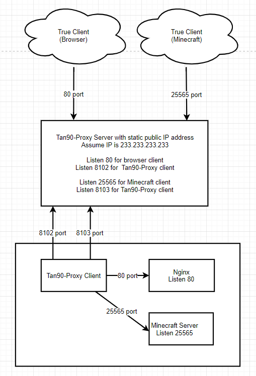

# Tan90-Proxy
NAT acorss proxy server - NAT穿透代理服务器

## Dependency  
* glib2
* libuv

## Build  

|Input              | Description                                                                   |
| :-                | :-                                                                            |
|**`make`**         |   build *libcommon.a* , *tan90-server* and *tan90-client* by **release** mode |
|**`make debug`**   |   build *libcommon.a* , *tan90-server* and *tan90-client* by **debug** mode   |
|**`make clean`**   |   remove all *.o* and *libcommon.a*                                           |
|**`make commom`**  |   build *libcommon.a* by **release** mode                                     |
|**`make server`**  |   build *tan90-server* by **release** mode                                    |
|**`make client`**  |   build *tan90-client* by **release** mode                                    |

## Usage


```bash
# server.ini
[Proxy of Nginx]
true_client_ip = 0.0.0.0
true_client_port = 80
proxy_client_ip = 0.0.0.0
proxy_client_port = 8102

[Proxy of Minecraft]
true_client_ip = 0.0.0.0
true_client_port = 25565
proxy_client_ip = 0.0.0.0
proxy_client_port = 8103
```

```bash
# client.ini
[Proxy of Nginx]
proxy_server_ip = 233.233.233.233
proxy_server_port = 8102
true_server_ip = 0.0.0.0
true_server_port = 80

[Proxy of Minecraft]
proxy_server_ip = 233.233.233.233
proxy_server_port = 8103
true_server_ip = 0.0.0.0
true_server_port = 25565
```

